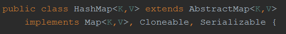
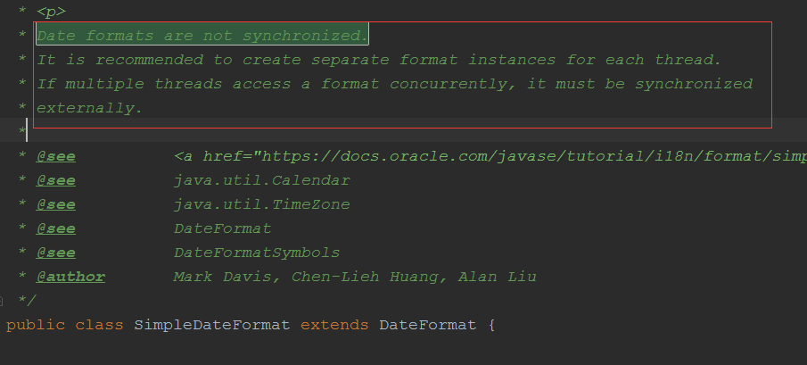

# 

##1.ArrayList, LinkedList, Vector，HashMap，Hashtable区别

``` tex
Arraylist：
优点：ArrayList 是实现了基于动态数组的数据结构,因为地址连续，一旦数据存储好了，查询操作效率会比较高（在内存里是连着放的）。
缺点：因为地址连续， ArrayList 要移动数据,所以插入和删除操作效率比较低。
  
LinkedList：
优点：LinkedList 基于链表的数据结构,地址是任意的，所以在开辟内存空间的时候不需要等一个连续的地址，对于新增和删除操作 add 和 remove，LinedList 比较占优势。LinkedList 适用于要头尾操作或插入指定位置的场景
缺点：因为 LinkedList 要移动指针,所以查询操作性能比较低

适用场景分析：
当需要对数据进行对此访问的情况下选用 ArrayList，当需要对数据进行多次增加删除修改时采用 LinkedList。

ArrayList 和 Vector 都是用数组实现的，主要有这么四个区别：
(1)	Vector 是多线程安全的，线程安全就是说多线程访问同一代码，不会产生不确定的结果。而 ArrayList 不是，这个可以从源码中看出，Vector 类中的方法很多有 synchronized 进行修饰，这样就导致了 Vector 在效率上无法与 ArrayList 相比；
(2)	两个都是采用的线性连续空间存储元素，但是当空间不足的时候，两个类的增加方式不同。
(3)	Vector 可以设置增长因子，而 ArrayList 不可以。
(4)	Vector 是一种老的动态数组，是线程同步的，效率很低，一般不赞成使用。


适用场景分析：
1)	Vector 是线程同步的，所以它也是线程安全的，而 ArrayList 是线程异步的，是不安全的。如果不考虑到线程的安全因素，一般用 ArrayList 效率比较高。
2)	如果集合中的元素的数目大于目前集合数组的长度时，在集合中使用数据量比较大的数据，用Vector 有一定的优势。

HashMap 和 Hashtable 的区别
1.	hashMap 去掉了 HashTable 的 contains 方法，但是加上了 containsValue()和 containsKey()
方法。
2.	hashTable 同步的，而 HashMap 是非同步的，效率上比 hashTable 要高。
3.	hashMap 允许空键值，而 hashTable 不允许，HashMap可以用null值和空字符串作为Key,不过只能有一个。 

TreeMap：非线程安全基于红黑树实现。
TreeMap 没有调优选项，因为该树总处于平衡状态。
Treemap：适用于按自然顺序或自定义顺序遍历键(key)。

HashSet 和 HashMap 区别

1)	set 是线性结构，set 中的值不能重复，hashset 是 set 的 hash 实现，hashset 中值不能重复是用 hashmap 的 key 来实现的。
2)	map 是键值对映射，可以空键空值。HashMap 是 Map 接口的 hash 实现，key 的唯一性是通过 key 值 hash 值的唯一来确定，value 值是则是链表结构。
3)	他们的共同点都是 hash 算法实现的唯一性，他们都不能持有基本类型，只能持有对象

HashMap 和 ConcurrentHashMap 的区别
ConcurrentHashMap 是线程安全的 HashMap 的实现。
(1)	ConcurrentHashMap 对整个桶数组进行了分割分段(Segment)，然后在每一个分段上都用
lock 锁进行保护，相对于 HashTable 的 syn 关键字锁的粒度更精细了一些，并发性能更好，而 HashMap 没有锁机制，不是线程安全的。
(2)	HashMap 的键值对允许有 null，但是 ConCurrentHashMap 都不允许。
```


##2. 集合线程安全的问题

```tex
1.Collection 是对象集合， Collection 有两个子接口 List 和 Set;

2.List 可以通过下标 (1,2..) 来取得值，值可以重复,而 Set只能通过游标来取值，并且值是不能重复的，（list是无序且可以重复的    set是有序且不可重复的） 

3.  ArrayList ， Vector ， LinkedList 是  List 的实现类 
     ArrayList 是线程不安全的， 
     Vector是线程安全的，
     这两个类底层都是由数组实现的 

     LinkedList 是线程不安全的，底层是由链表实现的 

4.Map 是键值对集合   HashTable 和 HashMap 是 Map 的实现类 

5.HashTable 是线程安全的，不能存储 null 值 

6.HashMap 不是线程安全的，可以存储 null 值 
```


##3. 对于ArrayLists和LinkedList的区别

``` tex
A. ArrayList是实现了基于动态数组的数据结构，LinkedList基于链表的数据结构。
     //正确，这里的所谓动态数组并不是那个“ 有多少元素就申请多少空间 
”的意思，通过查看源码，可以发现，这个动态数组是这样实现的，如果没指定数组大小，则申请默认大小为10的数组，当元素个数增加，数组无法存储时，系统会另个申请一个长度为当前长度1.5倍的数组，然后，把之前的数据拷贝到新建的数组。

B. 对于随机访问get和set，ArrayList觉得优于LinkedList，因为LinkedList要移动指针。//正确，ArrayList是数组，所以，直接定位到相应位置取元素，LinkedLIst是链表，所以需要从前往后遍历。


C. 对于新增和删除操作add和remove，LinedList比较占优势，因为ArrayList要移动数据。//正确，ArrayList的新增和删除就是数组的新增和删除，LinkedList与链表一致。


D. ArrayList的空间浪费主要体现在在list列表的结尾预留一定的容量空间，而LinkedList的空间花费则体现在它的每一个元素都需要消耗相当的空间。//正确，因为ArrayList空间的增长率为1.5倍，所以，最后很可能留下一部分空间是没有用到的，因此，会造成浪费的情况。对于LInkedList的话，由于每个节点都需要额外的指针，
```


## 4.几个集合说法正确的是

```tex
A.ConcurrentHashMap使用synchronized关键字保证线程安全

B.HashMap实现了Collction接口

C.Array.asList方法返回java.util.ArrayList对象

D.SimpleDateFormat是线程不安全的

解析:
A. JDK1.8 的 ConcurrentHashMap 采用CAS+Synchronized保证线程安全。 JDK1.7
  及以前采用segment的分段锁机制实现线程安全，其中segment继承自ReentrantLock，因此采用Lock锁来保证线程安全。 

B. 

C. Arrays.asList()  返回  java.util.Arrays.ArrayList 对象，这里的ArrayList 是 Arrays 私有的内部类 

D. 
```






## 5. HashMap的问题

```tex
JDK8以后，HashMap的数据结构是 数组+链表+红黑树

HashMap内部包含了一个默认大小为 16 Entry 类型的数组 table,其中每个Entry 是一个链表，
当链表长度大于等于 8 时会将链表转换为红黑树。

jdk1.7 中使用个 Entry 数组来存储数据，用key的 hashcode 取模来决定key会被放到数组里的位置，
如果 hashcode 相同，或者 hashcode 取模后的结果相同（ hash collision ），那么这些 key 会被定位到
Entry 数组的同一个格子里，这些 key 会形成一个链表。在 hashcode 特别差的情况下，比方说所有key的
hashcode 都相同，这个链表可能会很长，那么 put/get 操作都可能需要遍历这个链表，也就是说时间复杂度在最
差情况下会退化到 O(n) 
 
jdk1.8 中使用一个 Node 数组来存储数据，但这个 Node 可能是链表结构，也可能是红黑树结构，如果插入的
key 的 hashcode 相同，那么这些key也会被定位到 Node 数组的同个格子里。
如果同一个格子里的key不超过8个，使用链表结构存储。如果超过了8个，那么会调用 treeifyBin 函数，
将链表转换为红黑树。那么即使 hashcode 完全相同，由于红黑树的特点，查找某个特定元素，也只需要O(log n)
的开销也就是说put/get的操作的时间复杂度最差只有 O(log n)，
但是真正想要利用 JDK1.8 的好处，有一个限制：key的对象，必须正确的实现了 Compare 接口。
```

